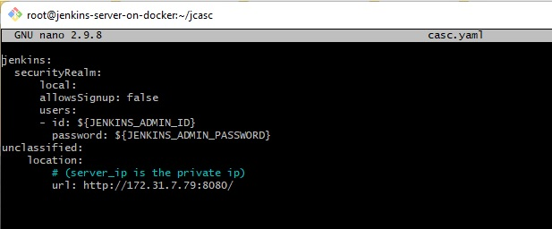

# Set a Jenkins server with CasC(Configuration as Code) plugin via Docker-Compose
  
   ### Step 4 — Creating a User (git branch: 4-create-a-user)

    So far, our setup has not implemented any authentication and authorization mechanisms. In this step, we will set up a basic, password-based authentication scheme and create a new user named admin.

    Start by opening our casc.yaml file:

    nano casc.yaml

    Then, add in the next snippet code:

    jenkins:
        securityRealm:
            local:
            allowsSignup: false
            users:
            - id: ${JENKINS_ADMIN_ID}
              password: ${JENKINS_ADMIN_PASSWORD}
    unclassified:
    ...

   

    In the context of Jenkins, a security realm is simply an authentication mechanism; the local security realm means to use basic authentication where users must specify their ID/username and password. Other security realms exist and are provided by plugins.

    Note that we’ve also specified allowsSignup: false, which prevents anonymous users from creating an account through the web interface.

    Finally, instead of hard-coding the user ID and password, we are using variables whose values can be filled in at runtime. This is important because one of the benefits of using JCasC is that the casc.yaml file can be committed into source control; if we were to store user passwords in plaintext inside the configuration file, we would have effectively compromised the credentials. Instead, variables are defined using the ${VARIABLE_NAME} syntax, and its value can be filled in using an environment variable of the same name, or a file of the same name that’s placed inside the /run/secrets/ directory within the container image.

    Next, build a new image to incorporate the changes made to the casc.yaml file:

    docker build -t jenkins:jcasc .

    Then, run the updated Jenkins image whilst passing in the JENKINS_ADMIN_ID and JENKINS_ADMIN_PASSWORD environment variables via the --env option (replace <password> with a password of your choice):

    docker run --name jenkins --rm -p 8080:8080 --env JENKINS_ADMIN_ID=admin --env JENKINS_ADMIN_PASSWORD=password jenkins:jcasc

    We can now go to server_ip:8080/login and log in using the specified credentials.