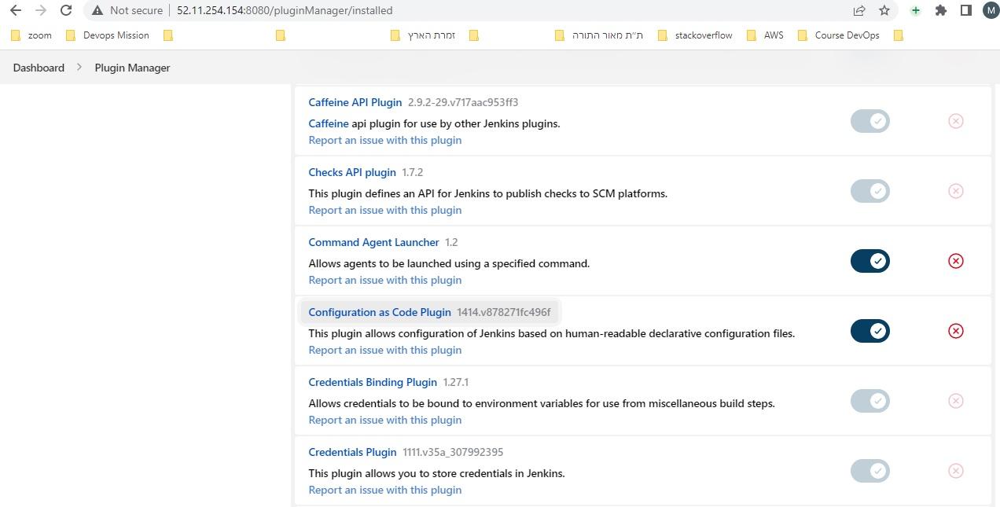

# Set a Jenkins server with CasC(Configuration as Code) plugin via Docker-Compose

  ## 1. Launch an EC2 instance for Docker server With internet access

   Security Group with Port '8080' open for internet
   

  ## 2. Connect to the ec2 machine(Amazon Linux ec2 machine) via git bash
   

  ## 3. Change hostname of the ec2 machine to jenkins-server-on-docker

        . sudo su -
        . hostname jenkins-server-on-docker
        . sudo su -

   

  ## 4. Install docker on EC2 instance
    
        . yum install docker -y
        . docker --version

   
   
   ## 5. Start docker services

        . service docker start
        . service docker status

   

   ## 6. Install docker-compose

        Download and install:
        . sudo curl -L https://github.com/docker/compose/releases/latest/download/docker-compose-$(uname -s)-$(uname -m) -o /usr/local/bin/docker-compose

        Fix permissions after download:
        . sudo chmod +x /usr/local/bin/docker-compose

        Check version:
        . docker-compose version

   

   ## 7. How to automate Jenkins setup with Docker-compose and Jenkins configuration as code?
    This involves the following steps:

        1. Disabling the Setup Wizard
        2. Installing Jenkins Plugins
        3. Specifying the Jenkins URL
        4. Creating a User
        5. Setting Up Authorization
        6. Setting Up Build Authorization

   ### Step 1 — Disabling the Setup Wizard (git branch: 1-disabling-setup-wizard)
    Using JCasC eliminates the need to show the setup wizard; therefore, in this first step, you’ll create a modified version of the official jenkins/jenkins image that has the setup wizard disabled. You will do this by creating a Dockerfile and building a custom Jenkins image from it.

    The jenkins/jenkins image allows you to enable or disable the setup wizard by passing in a system property named jenkins.install.runSetupWizard via the JAVA_OPTS environment variable. Users of the image can pass in the JAVA_OPTS environment variable at runtime using the --env flag to docker run. However, this approach would put the onus of disabling the setup wizard on the user of the image. Instead, you should disable the setup wizard at build time, so that the setup wizard is disabled by default.

    You can achieve this by creating a Dockerfile and using the ENV instruction to set the JAVA_OPTS environment variable.

    First, create a new directory inside your server to store the files

    . mkdir jcasc

    Navigate inside that directory:
    . cd jcasc

    Create the file named Dockerfile:
    . nano Dockerfile
   

    Copy the following content into the Dockerfile:
    
        FROM jenkins/jenkins:latest
        ENV JAVA_OPTS -Djenkins.install.runSetupWizard=false

    We’re using the FROM instruction to specify jenkins/jenkins:latest as the base image, and the ENV instruction to set the JAVA_OPTS environment variable. 

    Build a Docker image and assign it a unique tag (we’ll use jcasc here):

    docker build -t jenkins:jcasc .
   

    Check the docker images created with the comand:
    docker images
   

    Create a container with the custom image by running docker run:
    docker run --name jenkins_ctr --rm -p 8080:8080 jenkins:jcasc

    We used the --name jenkins_ctr option to give the container an easy-to-remember name; We also specified the --rm flag so the container will automatically be removed after you’ve stopped the container process. Lastly, you’ve configured your server host’s port 8080 to proxy to the container’s port 8080 using the -p flag; 8080 is the default port where the Jenkins web UI is served from.

    Jenkins will take a short period of time to initiate. When Jenkins is ready, you will see the following line in the output:
   

    Now, open up the browser to server_ip:8080. we’re immediately shown the dashboard without the setup wizard.
   

    We have just confirmed that the setup wizard has been disabled. To clean up, stop the container by pressing CTRL+C. If you’ve specified the --rm flag earlier, the stopped container would automatically be removed.

    In this step, we’ve created a custom Jenkins image that has the setup wizard disabled. However, the top right of the web interface now shows a red notification icon indicating there are issues with the setup. Click on the icon to see the details.
   
   

    The first warning informs us that we have not configured the Jenkins URL. The second tells us that we haven’t configured any authentication and authorization schemes, and that anonymous users have full permissions to perform all actions on your Jenkins instance. Previously, the setup wizard guided us through addressing these issues. Now that we’ve disabled it, you need to replicate the same functions using JCasC. we will modify our Dockerfile and JCasC configuration until no more issues remain (that is, until the red notification icon disappears).

    In the next step, we will begin that process by pre-installing a selection of Jenkins plugins, including the Configuration as Code plugin, into our custom Jenkins image.

   ### Step 2 — Installing Jenkins Plugins (git branch: 2-install-jenkins-plugins)

    To use JCasC, we need to install the Configuration as Code plugin. Currently, no plugins are installed. we can check this by navigating to http://server_ip:8080/pluginManager/installed.
   

    In this step, we’re going to modify our Dockerfile to pre-install a selection of plugins, including the Configuration as Code plugin.

    To automate the plugin installation process, we can make use of an installation script that comes with the jenkins/jenkins Docker image. You can find it inside the container at /usr/local/bin/install-plugins.sh. To use it, we would need to:

    . Create a text file containing a list of plugins to install.
    . Copy it into the Docker image.
    . Run the install-plugins.sh script to install the plugins.

    1. Create a new file named plugins.txt:
    nano plugins.txt

    Then, add in the following newline-separated list of plugin names and versions (using the format <id>:<version>):

    build-timeout:latest
    cloudbees-folder:latest
    configuration-as-code:latest
    credentials-binding:latest
    email-ext:latest
    git:latest
    github-branch-source:latest
    gradle:latest
    ldap:latest
    mailer:latest
    pipeline-github-lib:latest
    pipeline-stage-view:latest
    ssh-slaves:latest
    timestamper:latest

    The list contains the Configuration as Code plugin, as well as all the plugins suggested by the setup wizard. For example, we have the Git plugin, which allows Jenkins to work with Git repositories; we also have the Pipeline plugin, which is actually a suite of plugins that allows we to define Jenkins jobs as code.

    2. Next, open up the Dockerfile file:
    nano Dockerfile

    In it, add a COPY instruction to copy the plugins.txt file into the /usr/share/jenkins/ref/ directory inside the image; this is where Jenkins normally looks for plugins. Then, include an additional RUN instruction to run the install-plugins.sh script:

    COPY plugins.txt /usr/share/jenkins/ref/plugins.txt
    RUN /usr/local/bin/install-plugins.sh < /usr/share/jenkins/ref/plugins.txt

    3. Then, build a new image using the revised Dockerfile:
    docker build -t jenkins:jcasc .
   
   

    This step involves downloading and installing many plugins into the image, and may take some time to run depending on your internet connection. 
   
    4. Once the plugins have finished installing, run the new Jenkins image:
    docker run --name jenkins --rm -p 8080:8080 jenkins:jcasc
   

    After the Jenkins is fully up and running message appears on stdout, navigate to server_ip:8080/pluginManager/installed to see a list of installed plugins. We will see a solid checkbox next to all the plugins you’ve specified inside plugins.txt, as well as a faded checkbox next to plugins, which are dependencies of those plugins.

   

    We can check that the Configuration As Code plugin is installed.

    In this step, we’ve installed all the suggested Jenkins plugins and the Configuration as Code plugin. we’re now ready to use JCasC to tackle the issues listed in the notification box. In the next step, you will fix the first issue, which warns you that the Jenkins root URL is empty.

   ### Step 3 — Specifying the Jenkins URL (git branch: 3-specify-jenkins-url)

    The Jenkins URL is a URL for the Jenkins instance that is routable from the devices that need to access it. For example, if we’re deploying Jenkins as a node inside a private network, the Jenkins URL may be a private IP address, or a DNS name that is resolvable using a private DNS server. 

    We can set the Jenkins URL on the web interface by navigating to server_ip:8080/configure and entering the value in the Jenkins URL field under the Jenkins Location heading. Here’s how to achieve the same using the Configuration as Code plugin:

    1. Define the desired configuration of our Jenkins instance inside a declarative configuration file (which we’ll call casc.yaml).
    2. Copy the configuration file into the Docker image (just as you did for your plugins.txt file).
    3. Set the CASC_JENKINS_CONFIG environment variable to the path of the configuration file to instruct the Configuration as Code plugin to read it.

    1. create a new file named casc.yaml:
    nano casc.yaml

    Then, add in the following lines:
    unclassified:
        location:
            url: http://172.31.7.79:8080/ (172.31.7.79 is the private ip)

    unclassified.location.url is the path for setting the Jenkins URL. It is just one of a myriad of properties that can be set with JCasC. Valid properties are determined by the plugins that are installed.
    To see what properties are available, navigate to server_ip:8080/configuration-as-code/reference.

    2. open the Dockerfile file:
    nano Dockerfile

    Add a COPY instruction to the end of our Dockerfile that copies the casc.yaml file into the image at /var/jenkins_home/casc.yaml. We’ve chosen /var/jenkins_home/ because that’s the default directory where Jenkins stores all of its data:

    COPY casc.yaml /var/jenkins_home/casc.yaml

    3. Then. add a further ENV instruction that sets the CASC_JENKINS_CONFIG environment variable:

    ENV CASC_JENKINS_CONFIG /var/jenkins_home/casc.yaml

   

    Next, build the image:

    docker build -t jenkins:jcasc .

    And run the updated Jenkins image:

    docker run --name jenkins --rm -p 8080:8080 jenkins:jcasc

    As soon as the Jenkins is fully up and running log line appears, navigate to server_ip:8080 to view the dashboard. This time, we may have noticed the warning about the Jenkins URL has disappeared.

   

    Now, navigate to server_ip:8080/configure and scroll down to the Jenkins URL field. Check that the Jenkins URL has been set to the same value specified in the casc.yaml file.
    

    In this step, we used the Configuration as Code plugin to set the Jenkins URL. In the next step, we will tackle the second issue from the notifications list ("the Jenkins is currently unsecured" message).
   
    